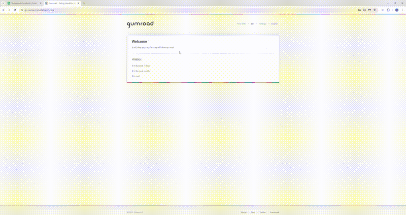

# Gumroad Hackathon Project


A rebuild of Gumroad's V1 website, from a Python-JS app deployed on App Engine, to a Rails-React app deployed on Heroku with a PostgreSQL database.

<!-- <a href="https://gr-replica.michellef.dev" target="_blank"></a><br> -->

<a href="https://www.youtube.com/watch?v=UUC9QnTv_fQ&t=57s&ab_channel=Michelle" target="_blank"></a>



## Table of Contents

- [Prerequisites](#prerequisites)
- [How To Set Up Project](#how-to-set-up-project)
- [How To Set Up Database](#how-to-set-up-db)
- [Useful Heroku Commands](#heroku-commands)
- [To Do](#to-do)

## Prerequisites<a name="prerequisites"></a>

- A GitHub account
- Git installed on your computer
- A Heroku account
- Optional: Heroku CLI installed on your computer (if using database, and also makes debugging easier)

## How To Set Up Project<a name="how-to-set-up-project"></a>

- Create your new repository from the Template (aka this repository)
  - Click the 'Use this template' green button at the top right of this page
  - Select 'Create a new repository'
    - Provide a name, description, and set it to public or private
    - Click 'Create repository'
- Set up your project locally
  - After creating your repository from the template, you need to set it up on your local machine for development
  - Open a terminal on your computer
  - Navigate into the folder you would like your project to reside in
    - e.g. `cd ~/Projects`
  - Clone the repository
    - `git clone https://github.com/USERNAME/REPOSITORY_NAME.git`
    - Note: replace USERNAME and REPOSITORY_NAME with your actual GitHub username and the name of the new repository you just created (NOT the boilerplate template)
  - Navigate into the project directory
    - `cd REPOSITORY_NAME`
      -Check the remote setup to verify that the repository URL has been set correctly
    - `git remote -v`
  - Now you can start making changes to the project:
    - To add changes: `git add .`
    - To commit change: `git commit -m "Your message"`
    - To push changes to GitHub: `git push origin main`
- Create an account with Heroku
  - Create a new app for your project
  - Set up the app
    - Resources Tab:
      - In the Add-ons section search ‘Heroku Postgres’ + submit order form to add it
    - Deploy Tab:
      - In the Deployment method section, select GitHub (connect to GitHub)
      - Connect to your GitHub and search for the repo you created and connect it
      - Click the button ‘Enable Automatic Deploys’
      - Note: now whenever you push a change to your GitHub repository, Heroku will deploy a new version of your app
    - Settings Tab:
      - In the Buildpack section:
        - Add buildpack: nodejs
        - Add buildpack: ruby
        - Note: nodejs buildpack must be before ruby!
    - Configure SSL:
      - Select ‘Automatic Certificate Management’ and click next
    - Optional: set a custom domain:
      - Click add domain, enter the domain name, click next
      - If the domain is a Root domain: ALIAS
      - If the domain is a non-root domain: CNAME
- Optional/Considerations:
  - Change favicon: reactapp/public/favicon
  - Change website title: reactapp/public/index.html
  - Add namespace for controllers: ‘api’
  - Download the Heroku CLI (see useful Heroku commands)

## How To Set Up Database<a name="how-to-set-up-db"></a>

- Already done:
  - In the previous step the PostgreSQL add-on should have been added :
    - In the Heroku app's Resources Tab:
      - In the Add-ons section search ‘Heroku Postgres’ + submit order form to add it
  - The 'pg' gem has already been added to the Gemfile
  - The config/database.yml file uses the DATABASE_URL env var provided by Heroku
- Make sure the Heroku CLI is downloaded
- Initialize the database locally:

  - download Postgres
  - setup a username/password
  - Create a database for this project:

    - Open a new terminal
    - type: psql -U your_username (default username is postgres)
    - login
    - In the postgres shell:
      - CREATE DATABASE [your-db-name];
    - To check/list all databases in your Postgres:
      - run: \l

  - Modify the config/database.yml file:
    - replace this code:
    ```
    development:
    <<: *default
    database: rails_project_development
    ```
    - with this code:
    ```
    development:
    <<: *default
    adapter: postgresql
    encoding: unicode
    database: <%= ENV['DATABASE_NAME'] %>
    username: <%= ENV['DATABASE_USERNAME'] %>
    password: <%= ENV['DATABASE_PASSWORD'] %>
    host: localhost
    ```
    - Add environment vars to the .env file:
      - DATABASE_NAME
      - DATABASE_USERNAME
      - DATABASE_PASSWORD
  - In the VSCode terminal of you projecty folder, run: rails db:schema:dump

- Initialize the database on Heroku :
  - In the terminal run:
    - `heroku run rails db:create --app your-app-name`
    - `heroku run rails db:migrate --app your-app-name`
    - `git add .`
    - `git commit -m 'initialize db'`
    - `git push origin main`
- Now that the database has been created, set up the tables

  - Add a .env file to the project with the following var:
    - CORS_ORIGINS=http://localhost:3000
  - In the terminal run `bundle install`
  - Start the rails server

    - Run `rails server`
    - Create a table migration file:
      - Run: `rails generate migration Create[YOURTABLENAMEHERE]`
    - Go to the folder db/migrate and find the newly created file

      - Example:

      ```ruby
      class CreateProducts < ActiveRecord::Migration[7.1]
        def change
          create_table :products do |t|
            t.string :name

            t.timestamps
          end
        end
      end
      ```

  - Commit the code to GitHub
    - `git add .`
    - `git commit -m "Add new table migration`
    - `git push origin main`
  - Run the following command to migrate the database locally:
    - rails db:migrate
  - Run the following comand to migrate the database on Heroku:
    - `heroku run rails db:migrate --app your-app-name`
  - Check if the tables are up on the server:
    - Run:
      - `heroku run rails console --app gr-replica`
      - `ActiveRecord::Base.connection.tables`

## Useful Heroku Commands <a name="heroku-commands"></a>

- Login: `heroku login`
- View Error Logs: `heroku logs -a gr-replica`
- Restart App: `heroku restart -a gr-replica`
- Migrate DB changes: `heroku run rails db:migrate -a gr-replica`
- Run the rails console: `heroku run rails console -a gr-replica`
- Seed the db: `heroku run rails db:seed -a gr-replica`

## To Do <a name="to-do"></a>

- Improve Header link reactivity to logged in status
- Forgot password feature not working
- Improve chart feature
- Add flowchart for Edit product page
- Condense Edit + Link page
